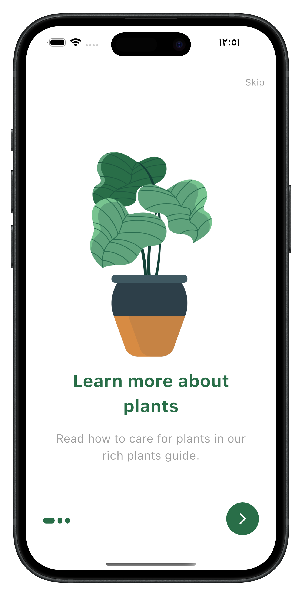
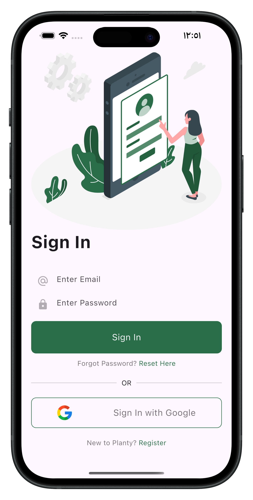
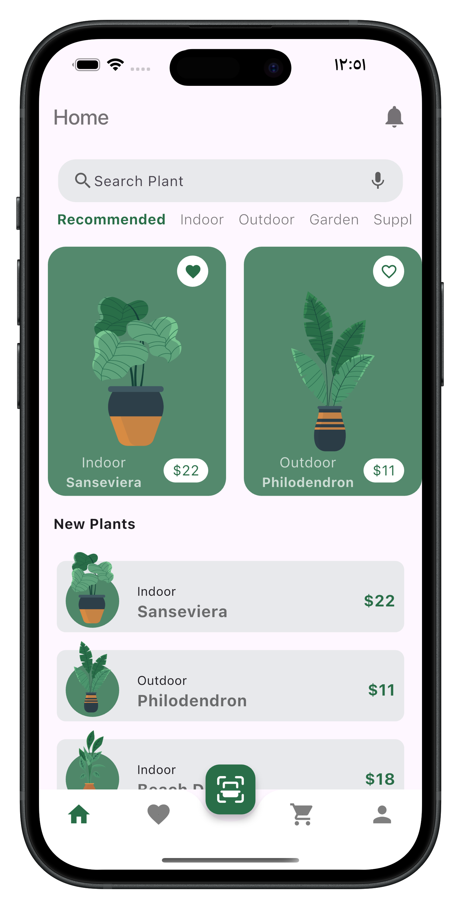
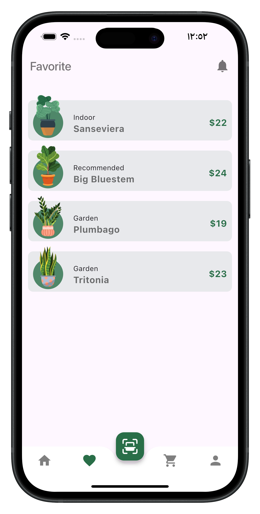
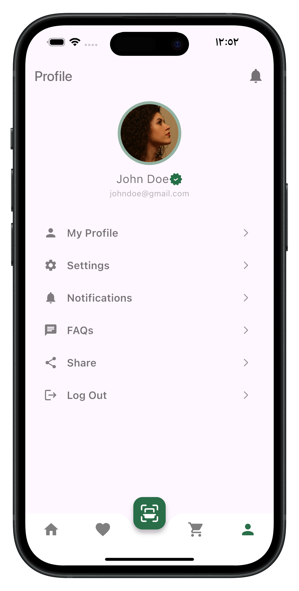
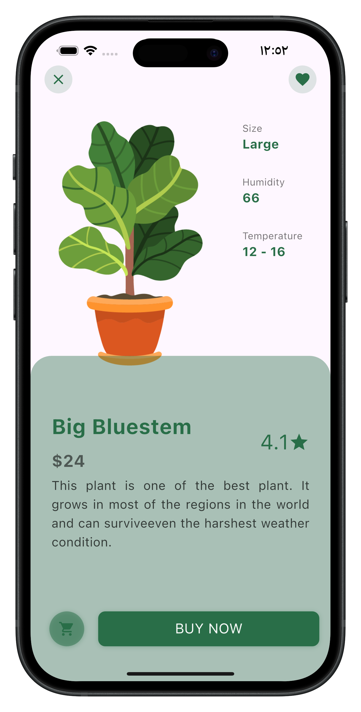

# plant_app

This Flutter application offers a seamless and visually appealing shopping experience for plant enthusiasts. It features a modern UI with a well-structured layout, allowing users to browse, search, and favorite plants effortlessly. The app incorporates a clean and intuitive design with smooth transitions, interactive elements, and category-based filtering.the app ensures high performance, scalability, and maintainability. This project highlights my expertise in Flutter development, UI/UX design, API integration, and state management, demonstrating my ability to create engaging and efficient mobile applications.

  
   
   
   
   
   

- [Lab: Write your first Flutter app](https://docs.flutter.dev/get-started/codelab)
- [Cookbook: Useful Flutter samples](https://docs.flutter.dev/cookbook)

For help getting started with Flutter development, view the
[online documentation](https://docs.flutter.dev/), which offers tutorials,
samples, guidance on mobile development, and a full API reference.
